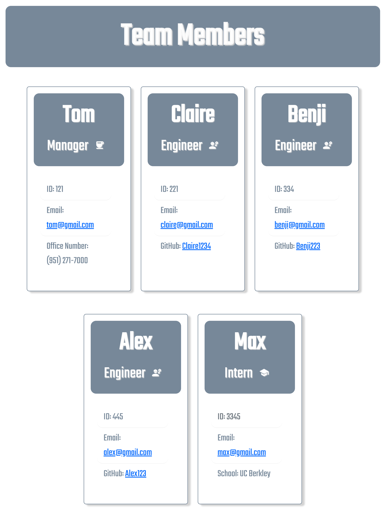

# Team Member Profile Generator

  
## Table Of Contents
  - [Motivation](#Motivation)
  - [Tools-Utilized](#Tools-Utilized)
  - [Installation](#Installation)
  - [Usage](#Usage)
  - [License](#License)
  - [Contribution](#Contribution)
  - [Tests](#Tests)
  - [Questions](#Questions)
  - [Credits](#Credits)
  
## Motivation

The motivation for this project is to provide users with a convenient and efficient way to produce an HTML file with a project's team members and each member's specific information. The HTML file's template includes sections such as the team member's role, name, email, and ID. Additional information such as office number, GitHub username, and Educational Institution is provided depending on what the team member's role is. 

In completing this project, I have learned the basic concepts of node.js while utilizing the inquirer and jest packages. The importance of writing test for applications was made clear when structuring the application.  

## Video Demonstration

[TeamMemberProfileGeneratorDemo](https://drive.google.com/file/d/164PDT53BlBl3CaawKBpHYlwYbeqsQLUM/view?usp=share_link)

## Tools Utilized

## Installation

This application requires the user to install node.js, inquirer package(v8.2.4).
*Optional- if user wants to run tests, jest must be installed*

## Usage

Once application code/files are transferred to preferred text editor, user opens command-line and runs the command node index.js. The application will then present prompts and user is required to answer them. After all questions are answered, a HTML file will be generated and reflect the team members added.

## License
    
Licensed under the [MIT](https://opensource.org/licenses/MIT) license

## Contribution

Provide any suggestions to the email listed below.

## Tests

To run this application, tests are not required.

## Questions

*Any questions please contact me through email*

cwalk280@yahoo.com

## Credits

Resources of significance:

Special thanks to Ileriayo Adebiyi https://github.com/Ileriayo/markdown-badges#testing and Lucas Himsel https://gist.github.com/lukas-h/2a5d00690736b4c3a7ba for their public library of common badges

